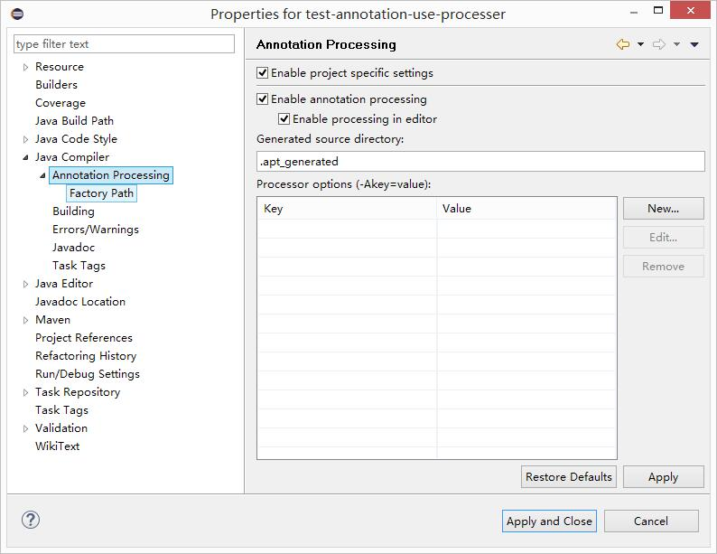
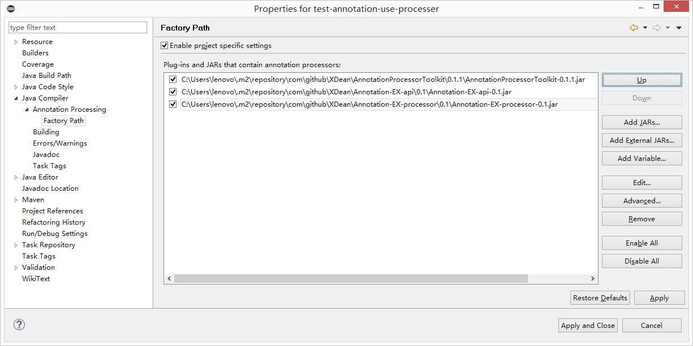

# Deannotation

# Release

See in each module.

# Features
- [@MethodRef](method-reference)
- [@Aggregation](aggregation)
- [@AutoMessage](https://github.com/XDean/auto-message)
- [Use in Eclipse](#use-in-eclipse)
- [Version changes](doc/ChangesNote.md)

# Use in Eclipse
1. Right click on your project, select `Java Compiler -> Annotation Processing`, enable the 3 options.

2. Right click on your project, select `Java Compiler -> Annotation Processing -> Factory Path`, add jars.
Note the dependencies order.

Or you can use [m2e-apt](https://marketplace.eclipse.org/content/m2e-apt) plugin.